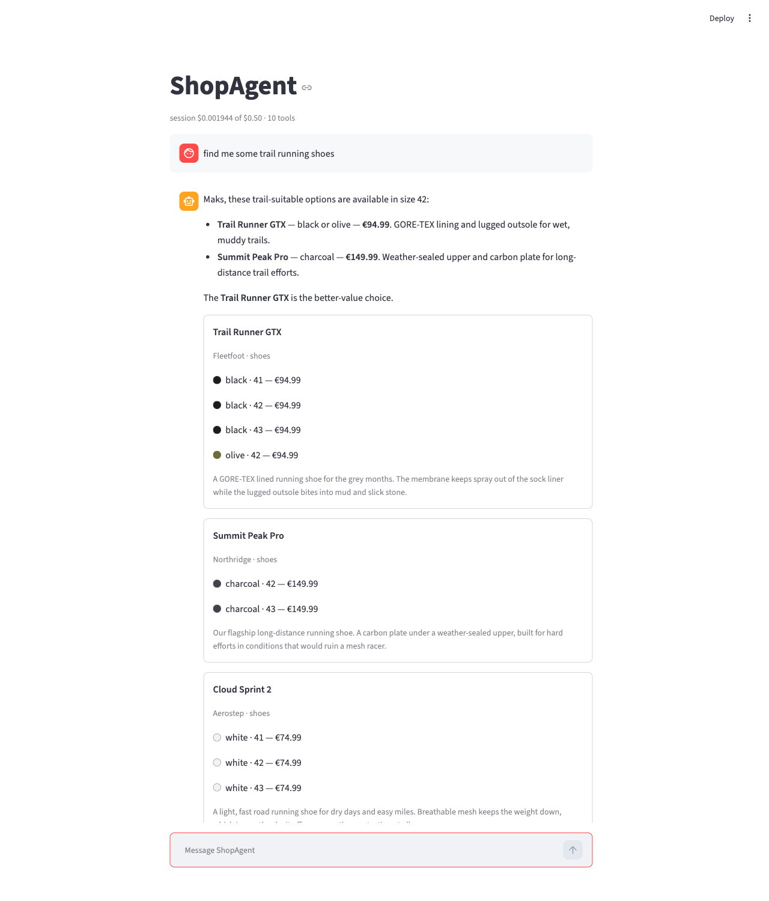

# ShopAgent

**A shop you talk to.** Find products, fill a basket and pay — all in plain
language, in a browser or a terminal. The catalog reaches the model over
**MCP**, the cart and orders over a **REST API**, and the money moves through
**Stripe**, where only a signed webhook may call an order paid.

It is a training project, written without an agent framework so that the agent
loop stays visible: a `while`, a message list, a dispatch, and every guard
built around it rather than inside it.

<p align="center">
  
</p>

---

## Contents

- [What it does](#what-it-does)
- [Quick start](#quick-start)
- [Running it](#running-it)
- [Configuration](#configuration)
- [How it works](#how-it-works)
- [Where the code lives](#where-the-code-lives)
- [Further reading](#further-reading)

---

## What it does

| | |
|---|---|
| **Search** | "waterproof boots under €150" — semantic search over 30 products with pgvector, plus filters on category, size, colour and price. |
| **Basket** | "add the second one, size 42" — the model resolves the ordinal against the list you are actually looking at. Stock is checked before a line is added. |
| **Checkout** | A Stripe Checkout Session with the test card `4242 4242 4242 4242`. Prices are frozen at order time and inventory is reserved under a row lock. |
| **Refunds** | "I want a refund" refunds this conversation's order in full, and reports it as *requested* — the order stays `paid` until Stripe confirms. |
| **Confirmation** | Anything irreversible — a purchase, a refund — is put to a person first, over a total the shop read back from the cart rather than one the model wrote. |
| **Memory** | "the second one" works, and so does remembering your shoe size between conversations. |
| **Observability** | Every turn shows which tools ran, in what order, what they answered and what it cost, with an optional Langfuse trace behind it. |

---

## Quick start

### Prerequisites

- Python 3.11+
- Docker, with `docker compose`
- An OpenAI API key
- A Stripe **test-mode** key — optional, but nothing can be paid for without one

### 1 — Install

```bash
python3 -m venv .venv
source .venv/bin/activate
python -m pip install --upgrade pip
pip install -r requirements.txt
pip install -e .
```

The last line is not optional: `src/` reaches the interpreter through the
editable install and through nothing else, so without it `import shopagent`
fails and every script, the CLI and the browser page fail with it.

### 2 — Configure

```bash
cp .env.example .env
```

Two values are required and the process refuses to start without them:

```bash
OPENAI_API_KEY=sk-...
SHOPAGENT_API_KEY=...   # any secret; generate one with the line below
```

```bash
python -c "import secrets; print(secrets.token_urlsafe(32))"
```

Everything else has a working default. To take a payment, add your Stripe test
key too — `STRIPE_SECRET_KEY=sk_test_...`. A live key is refused outright.

### 3 — Database

```bash
docker compose up -d
docker compose exec db psql -U shopagent -d shopagent \
  -c "CREATE EXTENSION IF NOT EXISTS vector;"
```

Postgres 16 + pgvector on `localhost:5432` (user / password / database all
`shopagent`), stored in the named volume `pgdata`. `docker compose down` stops
it and keeps the data.

### 4 — Catalog

```bash
python scripts/create_schema.py     # tables and the vector extension
python scripts/seed_catalog.py      # 30 products with variants and prices
python scripts/embed_catalog.py     # embeddings + HNSW index (costs a few cents)
```

### 5 — Migrations, then check

```bash
for f in migrations/*.sql; do
  docker compose exec -T db psql -U shopagent -d shopagent -f /dev/stdin < "$f"
done

python scripts/create_schema.py; echo "exit=$?"   # 0 is good, 2 means a gap
```

On a fresh database step 4 already built everything and the migrations print
`already exists, skipping` — they are idempotent, which is what makes running
them unconditionally the simpler instruction. They matter on a database that
predates a schema change: `create_all` creates tables that do not exist and
never alters one that does. The final check asks the *database* what it has,
compares it with the models, and exits **2** on any missing column or wrong
foreign key.

---

## Running it

Two processes, in two terminals. The API comes first, always — the cart,
checkout and refund tools reach it over HTTP, and without it the catalog still
answers while nothing can be bought.

```bash
# 1. the commerce API                      docs on http://localhost:8000/docs
uvicorn shopagent.api.main:app --reload --port 8000

# 2. the shop itself — pick one
streamlit run src/shopagent/ui/app.py      # browser, on http://localhost:8501
python -m shopagent.llm.loop               # the same agent in a terminal
```

A third terminal, only if you want to take a payment. Stripe has to be able to
reach the webhook for an order to become `paid`, and locally that is a tunnel:

```bash
stripe listen --forward-to localhost:8000/webhooks/stripe
```

It prints a `whsec_...` on startup — put that in `.env` as
`STRIPE_WEBHOOK_SECRET` and restart the API.

Then say something like *"waterproof boots under €150"*.

### In the browser

Chat is the whole interface — there is no grid to browse around the agent.
Search results appear as cards **inside** the message that produced them, and a
card is not clickable: nothing enters a basket except by asking. Variants are
grouped by colour, `black · 41, 42, 43 — €94.99`, with sold-out sizes struck
through rather than dropped, because "there is no 42" and "the 42 is gone" are
different sentences.

The basket sits in the sidebar, re-read from the shop on every draw rather than
from the conversation, and its one **Checkout** button goes through the same
confirmation gate the model does. Every turn carries a collapsed **activity
panel**: the tools that ran, their arguments, how long each took, whether one
was refused and why, and what the turn cost. Closed, the page is a
conversation; open, it is what this project is for.

### In the terminal

Slash commands inside the CLI:

| | |
|---|---|
| `/tools` | the tools the model can call |
| `/profile` | what the shop remembers about you between conversations |
| `/remember k=v` | record one field — `display_name`, `shoe_size`, `clothing_size`, `favourite_categories` |
| `/forget k` | clear one field |
| `/reset` | clear the history and re-read the profile |
| `/cost` | tokens and dollars for this session |

---

## Configuration

All of it goes through `src/shopagent/config.py`, which is the only reader of
the environment. `.env.example` documents every field; these are the ones worth
knowing about.

| Variable | Default | What it is |
|---|---|---|
| `OPENAI_API_KEY` | — | **Required.** |
| `SHOPAGENT_API_KEY` | — | **Required.** The key every cart and order call carries as `X-API-Key`. |
| `STRIPE_SECRET_KEY` | blank | Test mode only — an `sk_live_` key is refused when configuration is read. Blank means checkout answers 503 and nothing else breaks. |
| `STRIPE_WEBHOOK_SECRET` | blank | Printed by `stripe listen`. Without it an order can be placed but never becomes `paid`. |
| `CURRENCY` | `eur` | Changing it after seeding means a reseed: price rows carry the currency they were written with. |
| `SHOPPER_ID` | blank | Who you shop as, and the key of the profile remembered between conversations. A label, not a credential. Blank means no long-term memory, which is not an error. |
| `MCP_CATALOG_ENABLED` | `true` | The catalog's off switch. `false` runs the same agent with 8 tools instead of 11 and says the catalogue is unavailable — which is what makes "the product answers come from MCP" demonstrable rather than asserted. |
| `LANGFUSE_*` | blank | Tracing. Missing keys mean no traces and nothing else changes; the agent says so once in its banner. |
| `TRACE_REDACT_TEXT` | `true` | Replaces everything a person wrote — messages, the model's prose, the system prompt, the search query, `SHOPPER_ID` — with a salted digest before a trace leaves this machine. What still travels is the shop's own data and this process's own measurements. |
| `UI_SPEND_CAP_USD` | `0.50` | What one browser session may spend on model calls. Checked at the door of a turn, never inside one. |

Three base URLs exist and are deliberately not one: `APP_BASE_URL` is where
Stripe redirects a browser back to, `COMMERCE_API_BASE_URL` is where the agent
reaches the API, and `UI_BASE_URL` is where the Streamlit page runs. They are
the same machine locally and stop being one the moment anything moves.

---

## How it works

```
                               You
                                 │   "waterproof boots under €150"
                                 ▼
           ┌───────────────────────────────────────────┐
           │                 The agent                 │
           │  works out what you meant, picks a tool,  │
           │  and writes the reply                     │
           └─────────────────────┬─────────────────────┘
                                 │
           ┌───────────────────────────────────────────┐
           │               Safety checks               │
           │  asks you before anything is bought or    │
           │  refunded, and never quotes a price the   │
           │  shop did not give it                     │
           └─────────────────────┬─────────────────────┘
                                 │
               ┌─────────────────┴─────────────────┐
               ▼                                   ▼
  ┌──────────────────────────┐        ┌──────────────────────────┐
  │         Catalog          │        │           Shop           │
  │  search, sizes and stock │        │  basket, orders, payment │
  │  over MCP                │        │  over HTTP               │
  └────────────┬─────────────┘        └────────────┬─────────────┘
               │                                   │
               └─────────────────┬─────────────────┘
                                 ▼
                     ┌───────────────────────┐
                     │        Database       │
                     │  products · orders    │
                     └───────────▲───────────┘
                                 │
                                 │   only Stripe can say an order is paid
                          ┌──────┴──────┐
                          │    Stripe   │
                          └─────────────┘
```

### Two protocols, on purpose

The catalog reaches the model through **MCP** because it is somebody else's
data in the shape this project wanted to learn: a server publishes tools, the
client registers whatever it is given, and nothing on this side may match on a
tool name. That constraint is the point — swap the server and the agent gains
its tools without a line changing here. The catalog is also read-only and
idempotent, so the worst a bad call costs is a wasted round trip.

Cart and checkout reach it over **HTTP**, because they *write*, and because the
writes have to be reachable by callers that are not an agent at all.
`place_order` locks inventory under `SELECT ... FOR UPDATE`; only a signed
webhook may move an order to `paid`; a person with `curl` and the API key can
do everything the model can. Putting those behind MCP would have made this
project's own agent the only client of its own shop, and would have hidden the
protections that bind everyone rather than just the model.

### The gate binds the model, not the shop

The **Safety checks** box above is the confirmation gate and the output
guardrails, and it sits between the agent and the tools, above both protocols.
They exist because a model can be talked into spending money — not because HTTP
is dangerous. Nothing in `agent/` is a substitute for the inventory lock, the
lifecycle table or the webhook signature, which sit below and apply to every
caller.

Two things are gated, and the criterion is irreversibility rather than cost:
`create_checkout`, and `request_refund` — a refund gives money *back*, but
`refunded` is a terminal status this system cannot undo.

### Nothing opaque is handed to the model

A cart id, an order's checkout URL, a refund id: none of them appear in a tool
schema or a tool result. They are held on the conversation's state and the
interface prints the bytes the shop issued. This was measured rather than
feared — asked twice for the same 475-character payment link, the model
reproduced it correctly once and changed one character the second time, which
Stripe answers with a 401.

### The loop at the centre has never changed

Everything above wraps the agent loop rather than reaching inside it, and that
is checked rather than claimed: the source of `run_tool_loop` still hashes to
`161bdc1c…9d00` on `main` and on every branch since D2 — through a change of
where tools come from, a change to what the model is told and what it may say,
the addition of tracing, and the move into a browser.

---

## Where the code lives

Everything is under `src/shopagent/`.

| Path | What is in it |
|---|---|
| `llm/` | the agent loop, the OpenAI client, token and cost accounting |
| `agent/` | the system prompt, conversation memory, the profile, the confirmation gate and the output guardrails |
| `tools/` | the tool registry, the two local tools, and the commerce tools over HTTP |
| `catalog/` | models, seed data, embeddings and search — all the product logic |
| `mcp_server/` · `mcp_client/` | the catalog as MCP tools, and the client that registers whatever a server lists |
| `api/` | FastAPI: routers speak HTTP, services speak the domain, `lifecycle.py` owns every status change |
| `payments/` | the Stripe SDK layer, Checkout Sessions, and the catalog sync |
| `obs/` | redaction, tracing and the two wrappers that read what already exists |
| `evals/` | what this shop is claimed to do, and the runner that settles it |
| `ui/` | the Streamlit page, and the session module that decides a turn without importing `streamlit` |

Supporting directories: `scripts/` (schema, seed, embeddings, the MCP server,
the eval runner, the Stripe catalog sync), `migrations/` (numbered idempotent
SQL for the tables that hold real data), `tests/`, and `docs/screenshots/`.

---

## Further reading

- **[CLAUDE.md](CLAUDE.md)** — every convention in this repository and the
  reasoning behind it: why money is an integer, why two names for a price, why
  a webhook answers 200 to a permanent failure, why the gate parks its question
  instead of blocking for the answer.
- **[JOURNAL.md](JOURNAL.md)** — what was built each day, what was measured,
  what broke, and the open gaps.

---

Test mode only, throughout. `config.py` refuses a live Stripe key, and a second
check reads `livemode` back from Stripe itself, because a prefix is a string
this repository compares and `livemode` is not.
